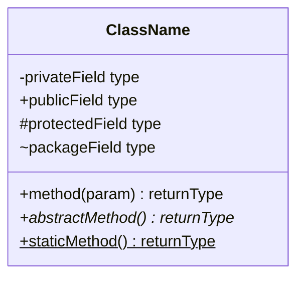

# Snakes and Ladders Game

A professionally designed Snakes and Ladders game implementation in Java, showcasing **SOLID principles**, **design patterns**, and **clean architecture**. Features configurable rules, multiple game modes, and extensible design for modern gameplay variations.

## Features

### Core Gameplay
- **Classic Snakes and Ladders** with traditional rules
- **Configurable board sizes** (customizable from 30-100 squares)
- **Multiple players support** (2+ players)
- **Random dice rolling** with deterministic seeding for testing

### Enhanced Game Modes
- **Entry Requirements**: Players must roll 6 to enter the board
- **Player Elimination**: Players can eliminate others by landing on same position
- **Winning Strategies**: 
  - Exact landing (must land exactly on 100)
  - Cross finish line (win by reaching or crossing 100)
- **Consecutive Sixes Penalty**: Reset to start after 3 consecutive sixes

### Technical Excellence
- **100% SOLID Principles** compliance
- **Multiple Design Patterns** implementation
- **Observer Pattern** for game events and statistics
- **Strategy Pattern** for dice implementations
- **Builder Pattern** for board and rules configuration
- **Immutable objects** for thread safety
- **Comprehensive error handling**

## 🏗️ Architecture

### SOLID Principles Implementation

#### 1. Single Responsibility Principle (SRP)
- **`Position`**: Manages only position data and validation
- **`Player`**: Handles only player state and behavior
- **`Board`**: Manages only board layout and position calculations
- **`GameEngine`**: Orchestrates game flow and turn management
- **`GameRules`**: Encapsulates only rule configurations

#### 2. Open/Closed Principle (OCP)
- **`Dice` interface**: Open for extension (new dice types), closed for modification
- **`GameObserver` interface**: Extensible for new event types
- **`WinningStrategy` enum**: Easily extendable for new winning conditions
- **`GameRules`**: New rules can be added without modifying existing code

#### 3. Liskov Substitution Principle (LSP)
- **`StandardDice`** can substitute **`Dice`** interface completely
- **`GameStatistics`** can substitute **`GameObserver`** interface fully
- All implementations maintain behavioral compatibility

#### 4. Interface Segregation Principle (ISP)
- **`Dice`**: Focused interface with only essential dice methods
- **`GameObserver`**: Specific event methods, clients implement only needed ones
- No fat interfaces forcing unnecessary dependencies

#### 5. Dependency Inversion Principle (DIP)
- **`GameEngine`** depends on **`Dice`** abstraction, not concrete implementation
- **`GameEngine`** depends on **`GameObserver`** interface, not specific observers
- High-level modules never depend on low-level module details

## 🎨 Design Patterns

### 1. Builder Pattern
**Used in**: `BoardBuilder`, `GameRules.GameRulesBuilder`

```java
Board board = new BoardBuilder()
    .setSize(100)
    .addSnake(new Position(99), new Position(54))
    .addLadder(new Position(8), new Position(31))
    .withDefaultSnakesAndLadders()
    .build();

GameRules rules = GameRules.custom()
    .withSixToEnter()
    .withPlayerCollisions()
    .withThreeSixesPenalty()
    .withCrossFinishLineWin()
    .build();
```

### 2. Strategy Pattern
**Used in**: `Dice` interface with `StandardDice` implementation

```java
Dice standardDice = new StandardDice();
Dice seededDice = new StandardDice(12345L); // For testing
GameEngine engine = new GameEngine(board, dice, players);
```

### 3. Observer Pattern
**Used in**: `GameObserver` interface with `GameStatistics` implementation

```java
GameEngine engine = new GameEngine(board, dice, players);
GameStatistics stats = new GameStatistics();
engine.addObserver(stats);
```

## 📋 Class Diagram & Mermaid.js Syntax

### Complete Architecture Overview

```mermaid
classDiagram
    %% Core Game Classes
    class GameEngine {
        -Board board
        -Dice dice
        -List~Player~ players
        -GameRules rules
        -List~GameObserver~ observers
        -int currentPlayerIndex
        -boolean gameEnded
        -Player winner
        +GameEngine(Board, Dice, List~Player~, GameRules)
        +startGame() void
        +addObserver(GameObserver) void
        +getCurrentPlayer() Player
        +getWinner() Player
        -playPlayerTurn(Player) void
        -executePlayerMove(Player, int) void
        -handleBoardEntry(Player, int) void
        -checkForWinner() void
        -moveToNextPlayer() void
        -validateGameSetup(Board, Dice, List~Player~, GameRules) void
    }

    class Board {
        -int size
        -List~Snake~ snakes
        -List~Ladder~ ladders
        +Board(BoardBuilder)
        +getFinalPosition(Position) Position
        +getSize() int
        +getSnakes() List~Snake~
        +getLadders() List~Ladder~
        +toString() String
    }

    class BoardBuilder {
        -int size
        -List~Snake~ snakes
        -List~Ladder~ ladders
        +BoardBuilder()
        +setSize(int) BoardBuilder
        +addSnake(Position, Position) BoardBuilder
        +addLadder(Position, Position) BoardBuilder
        +withDefaultSnakesAndLadders() BoardBuilder
        +build() Board
        -validateBoard() void
    }

    class Player {
        -String name
        -Position currentPosition
        -boolean hasEnteredBoard
        -int consecutiveSixes
        -int totalMoves
        +Player(String)
        +getName() String
        +getCurrentPosition() Position
        +setCurrentPosition(Position) void
        +hasWon() boolean
        +hasWon(WinningStrategy) boolean
        +hasEnteredBoard() boolean
        +getConsecutiveSixes() int
        +getTotalMoves() int
        +rollSix() void
        +rollNonSix() void
        +enterBoard() void
        +resetToStart() void
        +incrementMoves() void
        +toString() String
    }

    class Position {
        -int value
        +Position(int)
        +getValue() int
        +equals(Object) boolean
        +hashCode() int
        +toString() String
    }

    %% Game Entities
    class Snake {
        -Position head
        -Position tail
        +Snake(Position, Position)
        +getHead() Position
        +getTail() Position
        +hasSnakeAt(Position) boolean
        +getDestination() Position
        +toString() String
    }

    class Ladder {
        -Position bottom
        -Position top
        +Ladder(Position, Position)
        +getBottom() Position
        +getTop() Position
        +hasLadderAt(Position) boolean
        +getDestination() Position
        +toString() String
    }

    %% Rules System
    class GameRules {
        -boolean needSixToEnter
        -boolean allowPlayerCollisions
        -boolean threeSixesPenalty
        -WinningStrategy winningStrategy
        -int maxConsecutiveSixes
        -GameRules(GameRulesBuilder)
        +needSixToEnter() boolean
        +allowPlayerCollisions() boolean
        +hasThreeSixesPenalty() boolean
        +getWinningStrategy() WinningStrategy
        +getMaxConsecutiveSixes() int
        +createClassicRules()$ GameRules
        +createModernRules()$ GameRules
        +custom()$ GameRulesBuilder
        +toString() String
    }

    class GameRulesBuilder {
        -boolean needSixToEnter
        -boolean allowPlayerCollisions
        -boolean threeSixesPenalty
        -WinningStrategy winningStrategy
        -int maxConsecutiveSixes
        +GameRulesBuilder()
        +withSixToEnter() GameRulesBuilder
        +withoutSixToEnter() GameRulesBuilder
        +withPlayerCollisions() GameRulesBuilder
        +withoutPlayerCollisions() GameRulesBuilder
        +withThreeSixesPenalty() GameRulesBuilder
        +withoutThreeSixesPenalty() GameRulesBuilder
        +withExactLandingWin() GameRulesBuilder
        +withCrossFinishLineWin() GameRulesBuilder
        +withMaxConsecutiveSixes(int) GameRulesBuilder
        +build() GameRules
    }

    class WinningStrategy {
        <<enumeration>>
        EXACT_LANDING
        CROSS_FINISH_LINE
        -String description
        +WinningStrategy(String)
        +getDescription() String
    }

    %% Strategy Pattern - Dice
    class Dice {
        <<interface>>
        +roll() int
        +getMinValue() int
        +getMaxValue() int
    }

    class StandardDice {
        -Random random
        -int MIN_VALUE$
        -int MAX_VALUE$
        +StandardDice()
        +StandardDice(long)
        +roll() int
        +getMinValue() int
        +getMaxValue() int
        +toString() String
    }

    %% Observer Pattern
    class GameObserver {
        <<interface>>
        +onPlayerMoved(Player, Position, Position, int) void
        +onSnakeEncounter(Player, Position, Position) void
        +onLadderEncounter(Player, Position, Position) void
        +onPlayerWon(Player, int) void
        +onGameStarted(List~Player~) void
        +onGameEnded(Player, int) void
        +onPlayerEliminated(Player, Player) void
        +onConsecutiveSixesPenalty(Player) void
        +onPlayerEnteredBoard(Player) void
        +onPlayerNeedsToEnter(Player, int) void
    }

    class GameStatistics {
        -int totalMoves
        -int snakeEncounters
        -int ladderEncounters
        -int playerEliminations
        -int consecutiveSixesPenalties
        -long gameStartTime
        +GameStatistics()
        +onPlayerMoved(Player, Position, Position, int) void
        +onSnakeEncounter(Player, Position, Position) void
        +onLadderEncounter(Player, Position, Position) void
        +onPlayerWon(Player, int) void
        +onGameStarted(List~Player~) void
        +onGameEnded(Player, int) void
        +onPlayerEliminated(Player, Player) void
        +onConsecutiveSixesPenalty(Player) void
        +onPlayerEnteredBoard(Player) void
        +onPlayerNeedsToEnter(Player, int) void
        +printStatistics() void
        +getTotalMoves() int
        +getSnakeEncounters() int
        +getLadderEncounters() int
    }

    %% Demo Classes
    class App {
        +main(String[])$ void
        -playQuickGame()$ void
        -playCustomGame()$ void
    }

    class SimpleDemo {
        +main(String[])$ void
    }

    class QuickDemo {
        +main(String[])$ void
    }

    class InteractiveDemo {
        +main(String[])$ void
        -getUserChoice(String, String[])$ String
        -createCustomRules()$ GameRules
    }

    %% Relationships - Composition and Aggregation
    GameEngine *-- Board : contains
    GameEngine *-- Dice : uses
    GameEngine o-- Player : manages
    GameEngine *-- GameRules : configured by
    GameEngine o-- GameObserver : notifies

    %% Builder Pattern Relationships
    BoardBuilder ..> Board : creates
    GameRulesBuilder ..> GameRules : creates
    GameRules *-- GameRulesBuilder : inner builder

    %% Entity Relationships
    Board *-- Snake : contains
    Board *-- Ladder : contains
    Board ..> Position : uses
    Player *-- Position : has current
    Snake *-- Position : head and tail
    Ladder *-- Position : bottom and top

    %% Strategy Pattern
    StandardDice ..|> Dice : implements
    GameEngine ..> Dice : depends on

    %% Observer Pattern
    GameStatistics ..|> GameObserver : implements
    GameEngine ..> GameObserver : notifies

    %% Rules and Strategy
    GameRules *-- WinningStrategy : uses
    Player ..> WinningStrategy : checked against

    %% Demo Dependencies
    App ..> GameEngine : creates
    App ..> BoardBuilder : uses
    App ..> GameStatistics : uses
    SimpleDemo ..> GameEngine : creates
    QuickDemo ..> GameEngine : creates
    InteractiveDemo ..> GameEngine : creates
    InteractiveDemo ..> GameRulesBuilder : uses

    %% Design Pattern Annotations
    note for BoardBuilder "Builder Pattern"
    note for GameRulesBuilder "Builder Pattern"
    note for Dice "Strategy Pattern"
    note for GameObserver "Observer Pattern"
```



### 🔧 Mermaid.js Syntax Reference

#### Class Definition


#### Relationships
| Syntax | Type | Description |
|--------|------|-------------|
| `A --|> B` | Inheritance | A extends B |
| `A ..|> B` | Implementation | A implements B |
| `A --> B` | Association | A uses B |
| `A --* B` | Composition | A contains B (strong) |
| `A --o B` | Aggregation | A has B (weak) |
| `A ..> B` | Dependency | A depends on B |

#### Annotations
- `<<interface>>` - Interface
- `<<abstract>>` - Abstract class  
- `<<enumeration>>` - Enum
- `<<service>>` - Service class

#### Visibility Modifiers
- `+` Public
- `-` Private
- `#` Protected
- `~` Package/Internal

#### Method Modifiers
- `*` Abstract method
- `$` Static method

## 🎯 Game Rules Configuration

### Classic Rules (Traditional)
```java
GameRules classic = GameRules.createClassicRules();
// - No entry requirement (start immediately)
// - No player collisions
// - No consecutive sixes penalty
// - Must land exactly on 100 to win
```

### Modern Rules (Enhanced)
```java
GameRules modern = GameRules.createModernRules();
// - Must roll 6 to enter board
// - Players can eliminate each other
// - 3 consecutive sixes penalty (reset to start)
// - Win by reaching or crossing 100
```

### Custom Rules (Flexible)
```java
GameRules custom = GameRules.custom()
    .withSixToEnter()                    // Entry requirement
    .withPlayerCollisions()              // Elimination enabled
    .withThreeSixesPenalty()            // Penalty for 3 sixes
    .withCrossFinishLineWin()           // Flexible winning
    .withMaxConsecutiveSixes(4)         // Custom penalty threshold
    .build();
```

## 🚀 Usage Examples

### Quick Start
```java
// Create a standard board
Board board = new BoardBuilder()
    .withDefaultSnakesAndLadders()
    .build();

// Setup players
List<Player> players = Arrays.asList(
    new Player("Alice"),
    new Player("Bob")
);

// Create game with classic rules
GameEngine game = new GameEngine(board, new StandardDice(), players);

// Add observer for statistics
game.addObserver(new GameStatistics());

// Start playing!
game.startGame();
```

### Custom Game Setup
```java
// Create custom board
Board customBoard = new BoardBuilder()
    .setSize(50)
    .addSnake(new Position(49), new Position(25))
    .addSnake(new Position(35), new Position(7))
    .addLadder(new Position(8), new Position(24))
    .addLadder(new Position(15), new Position(42))
    .build();

// Create modern rules
GameRules modernRules = GameRules.createModernRules();

// Setup game
GameEngine game = new GameEngine(customBoard, new StandardDice(), players, modernRules);
game.startGame();
```

### Interactive Demo
```java
// Run the interactive demo to explore different rule combinations
java InteractiveDemo
```

## 📁 Project Structure

```
src/
├── core/
│   ├── Position.java          # Immutable position representation
│   ├── Player.java            # Player with enhanced state tracking
│   ├── Snake.java             # Immutable snake entity
│   └── Ladder.java            # Immutable ladder entity
│
├── game/
│   ├── Board.java             # Game board with snakes and ladders
│   ├── BoardBuilder.java      # Builder for board creation
│   ├── GameEngine.java        # Main game orchestrator
│   ├── GameRules.java         # Configurable rule system
│   └── WinningStrategy.java   # Winning condition strategies
│
├── interfaces/
│   ├── Dice.java              # Dice abstraction
│   └── GameObserver.java      # Observer for game events
│
├── implementations/
│   ├── StandardDice.java      # Standard 6-sided dice
│   └── GameStatistics.java   # Statistics collector
│
└── demos/
    ├── App.java               # Main application
    ├── SimpleDemo.java        # Basic demonstration
    ├── QuickDemo.java         # Quick feature showcase
    └── InteractiveDemo.java   # Interactive rule selection
```

## 🔧 Compilation and Execution

### Compile the Project
```bash
javac *.java
```

### Run Different Demos

#### Main Application
```bash
java App
```

#### Quick Feature Demo
```bash
java QuickDemo
```

#### Interactive Rule Selection
```bash
java InteractiveDemo
```

#### Simple Game Demo
```bash
java SimpleDemo
```

## 🧪 Testing

The codebase includes deterministic testing capabilities:

```java
// Use seeded dice for reproducible tests
Dice testDice = new StandardDice(12345L);
GameEngine testGame = new GameEngine(board, testDice, players);
```

## 🔄 Extensibility

### Adding New Dice Types
```java
public class LoadedDice implements Dice {
    // Custom dice implementation
    public int roll() {
        return 6; // Always rolls 6
    }
}
```

### Adding New Observers
```java
public class GameLogger implements GameObserver {
    public void onPlayerMoved(Player player, Position oldPos, Position newPos, int dice) {
        System.out.println(player.getName() + " moved from " + oldPos + " to " + newPos);
    }
    // Implement other methods...
}
```

### Adding New Rules
```java
// Extend GameRulesBuilder with new methods
public GameRulesBuilder withCustomRule(boolean enabled) {
    this.customRule = enabled;
    return this;
}
```

## 📈 Performance Considerations

- **Immutable Objects**: Thread-safe design with no synchronization overhead
- **Efficient Collections**: Uses ArrayList for O(1) access patterns
- **Minimal Object Creation**: Reuses objects where possible
- **Early Termination**: Game ends immediately when winning condition is met
- **Timeout Protection**: Prevents infinite games with turn limits

## 🎮 Game Statistics

The `GameStatistics` observer tracks:
- Total game duration (moves)
- Snake encounters per player
- Ladder encounters per player
- Player eliminations
- Consecutive sixes penalties
- Final game results

## 🤝 Contributing

This project demonstrates professional software development practices:

1. **SOLID Principles** - Every class follows single responsibility
2. **Design Patterns** - Proper implementation of Builder, Strategy, Observer
3. **Clean Code** - Readable, maintainable, and well-documented
4. **Extensible Design** - Easy to add new features without breaking existing code
5. **Error Handling** - Comprehensive validation and exception handling

## 📄 License

This project is designed for educational purposes, demonstrating advanced object-oriented design principles and clean architecture patterns.

---

**Built with ❤️ using Java and SOLID principles**